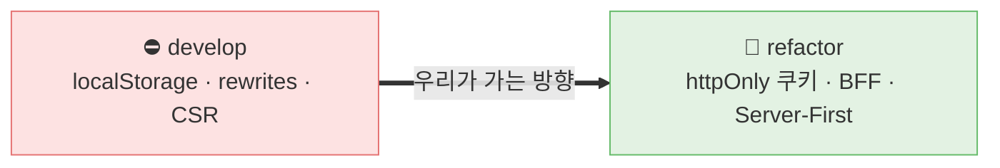
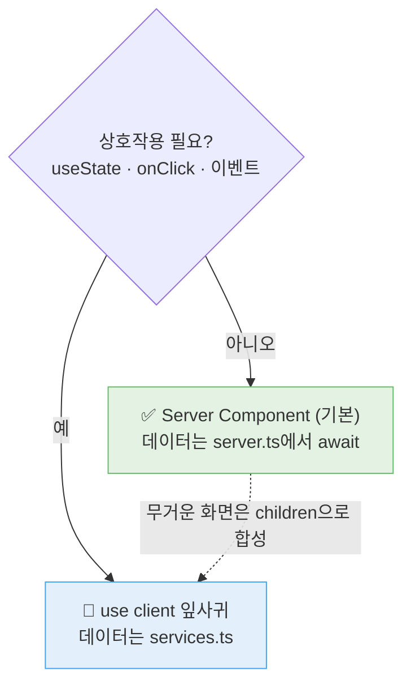
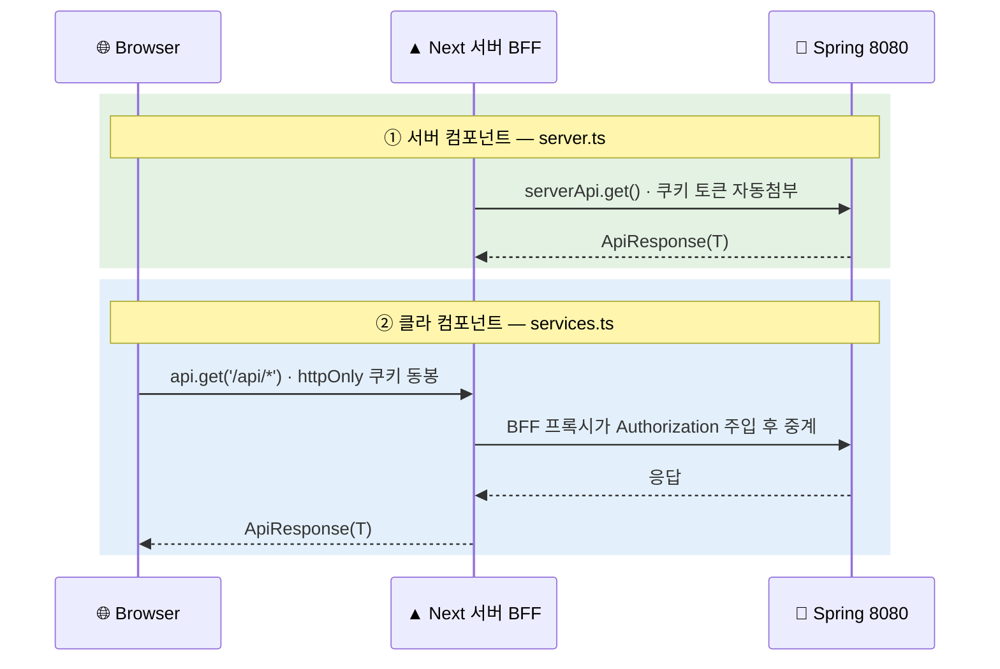
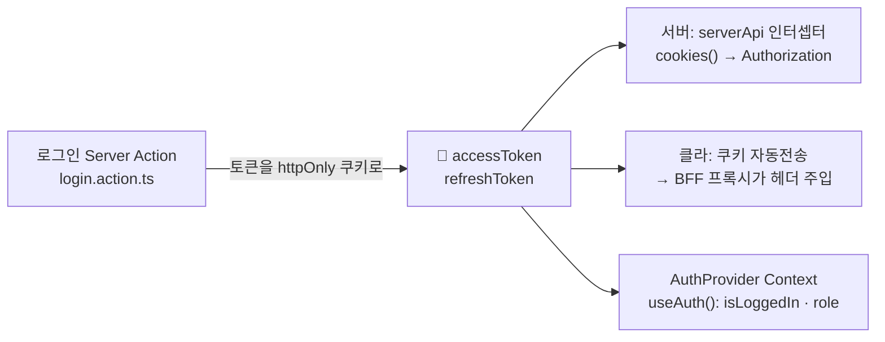
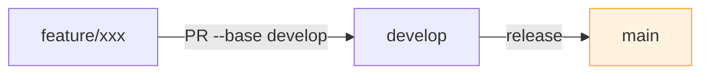

<div align="center">

# 🎨 FLOWN 프론트엔드 코드 컨벤션

**Next.js 16 · React 19 · TypeScript 5 · Tailwind v4 · Server-First + BFF**

우리 팀(`hard-click-frontend`)의 **실제 코드 구조** 기준 코딩 규칙 · 새 코드는 이 문서를 따른다

</div>

> [!NOTE]
> **상태 범례** — 규칙은 마이그레이션 단계에 따라 표시됩니다.
> | 뱃지 | 의미 |
> |:--:|---|
> | ✅ **표준** | 확정된 규칙. 지금 바로 따른다 |
> | 🎯 **전환 중** | `refactor/server-first-migration`에서 도입, `develop` 머지 예정. **새 코드는 이 방식으로** |
> | ⛔ **레거시** | `develop`에 남은 구 방식. **새로 쓰지 말 것**, 보이면 점진 제거 |

---

## 📑 목차

1. [🚦 마이그레이션 현황](#-1-마이그레이션-현황-develop--refactor)
2. [⚡ 핵심 원칙](#-2-핵심-원칙-3줄)
3. [🧱 기술 스택 & 실행](#-3-기술-스택--실행)
4. [📂 디렉터리 구조 & 배치](#-4-디렉터리-구조--배치-규칙)
5. [🔤 네이밍](#-5-네이밍-컨벤션)
6. [🪟 렌더링 (Server-First)](#-6-렌더링-server-first)
7. [🔌 데이터 레이어](#-7-데이터-레이어--핵심)
8. [📝 데이터 변경 (Server Actions)](#-8-데이터-변경-server-actions)
9. [🔐 인증](#-9-인증-httponly-쿠키)
10. [🧩 TypeScript](#-10-typescript-규칙)
11. [🎨 스타일링 & Mock](#-11-스타일링--mock-정책)
12. [🌿 Git / 브랜치 / 커밋](#-12-git--브랜치--커밋)
13. [✅ Do / Don't 치트시트](#-13-do--dont-치트시트)

---

## 🚦 1. 마이그레이션 현황 (develop ↔ refactor)

> [!IMPORTANT]
> `develop`은 아직 **클라이언트 중심(구 방식)** 이고, **Server-First/BFF 인프라는 `refactor/server-first-migration` 브랜치에만** 있습니다. 새 작업은 아래 🎯 방식을 따르세요.

| 영역 | ⛔ develop (구) | 🎯 refactor (신·표준) | 확인 근거 |
|---|---|---|---|
| **백엔드 프록시** | `next.config` `rewrites` | **BFF 라우트 핸들러** `app/api/[...path]/route.ts` | develop엔 핸들러 없음 |
| **인증 토큰** | `localStorage` (`store/auth.store.ts`, 14곳) | **httpOnly 쿠키** + `AuthProvider`·`login.action.ts` | auth.store는 refactor에서 제거 |
| **서버 조회** | `services.ts`(클라 axios)만 | + **`features/*/server.ts`** (serverApi) | server.ts: develop `0개` → refactor `7개` |
| **Mock 토글** | 서비스마다 산재 | **중앙 `src/mocks/config.ts`** (`USE_MOCK`) | develop엔 중앙 config 없음 |
| **렌더링** | `'use client'` 78개 (CSR 중심) | Server Component 기본 (잎사귀 전환 진행 중) | 80개 — 전환 진행형 |



---

## ⚡ 2. 핵심 원칙 (3줄)

> [!TIP]
> 이 3가지만 지키면 나머지는 자연스럽게 따라온다.

1. 🖥️ **Server-First** — 화면 기본은 **Server Component**, `'use client'`는 상호작용 잎사귀(버튼·폼·입력)에만.
2. 📝 **변경은 Server Action + BFF** — 브라우저가 Spring을 직접 부르지 않는다. **Next 서버가 중계**한다.
3. 🔐 **토큰은 httpOnly 쿠키** — `localStorage`에 토큰 저장 ❌ (XSS 방지).

---

## 🧱 3. 기술 스택 & 실행

| 구분 | 내용 |
|---|---|
| **프레임워크** | Next.js 16 (App Router) · React 19 |
| **언어 / 스타일** | TypeScript 5 · Tailwind v4 |
| **통신 / UI** | axios · sonner(toast) · hls.js(영상) |
| **경로 별칭** | **`@/*` → `src/*`** (상대경로 `../../` 지양) |
| **백엔드 URL** | env `NEXT_PUBLIC_API_BASE_URL` (기본 `http://localhost:8080`) |

```bash
cd hard-click-frontend     # ⚠️ 앱은 루트가 아니라 이 하위 폴더
npm install
npm run dev    # localhost:3000
npm run build  # 활성 라우트의 빈 page.tsx 있으면 실패
npm run lint
```

---

## 📂 4. 디렉터리 구조 & 배치 규칙

```
src/
├─ app/                          # 라우트 (폴더=URL, page.tsx=화면)
│  ├─ (user)/                    # 학생 그룹 · instructor/ · admin/
│  ├─ api/[...path]/route.ts     # 🎯 BFF 프록시 (클라 /api/* → 백엔드 중계)
│  └─ layout.tsx · not-found.tsx
├─ features/<도메인>/            # ⭐ 도메인별 기능 단위
│  ├─ types.ts                   # UI 타입 + 백엔드(XxxApiResponse) 타입 + toXxx 매퍼
│  ├─ server.ts                  # 🎯 서버 컴포넌트용 조회 (serverApi)
│  ├─ services.ts                # 클라이언트용 호출 (api)
│  ├─ actions.ts                 # Server Actions ('use server')
│  └─ components/                # 이 도메인 전용 컴포넌트
├─ components/
│  ├─ ui/                        # 디자인 원자 (avatar, badge) — 파일명 lowercase
│  ├─ common/                    # 공통 (PageTitle, RatingStars, RequireAuth) — PascalCase
│  └─ layout/                    # headers/ · containers/ · navigation/
├─ lib/                          # api.ts(serverApi) · formatter · guards · utils
├─ services/                     # api.ts(클라 api + ApiResponse) · *.service.ts
└─ mocks/                        # config.ts(USE_MOCK) · <도메인>.mock.ts
```

**📍 "이 컴포넌트 어디 둘까?" 결정표**

| 상황 | 위치 |
|---|---|
| 한 도메인에서만 사용 | `features/<도메인>/components/` |
| 한 라우트에서만 사용 | `app/.../` 옆 co-location 허용 |
| 여러 도메인 공통 | `components/common/` |
| 디자인 시스템 원자(버튼·뱃지 등) | `components/ui/` |
| **모달** | ❗ 새로 만들기 전 `features/*/components/`·`components/ui/` **먼저 검색** |

> [!NOTE]
> **빈(0바이트) 파일은 "구조 먼저 잡기"용 의도된 스캐폴딩**입니다. 지우지 말고 구현 시점에 채우세요.

---

## 🔤 5. 네이밍 컨벤션

| 대상 | 규칙 | 예시 |
|---|---|---|
| 컴포넌트 파일 | `PascalCase.tsx` | `CourseCard.tsx` |
| `components/ui/` 원자 | `lowercase.tsx` (shadcn) | `avatar.tsx`, `badge.tsx` |
| 훅 | `useXxx.ts` | `useResendCooldown.ts` |
| Server Action | `xxxAction` | `loginAction`, `createPostAction` |
| 응답 → UI 매퍼 | `toXxx` | `toCourseDetail` |
| 백엔드 응답 타입 | `XxxApiResponse` / `XxxApiItem` | `CourseDetailApiResponse` |
| 객체 타입 | `interface` PascalCase | `interface CourseDetail` |
| 유니언 / 별칭 | `type` | `type Role = 'STUDENT' \| 'INSTRUCTOR'` |

---

## 🪟 6. 렌더링 (Server-First)



> [!WARNING]
> **`useEffect` + `useState`로 데이터 페칭하지 말 것** (깜빡임·SEO·보안 손해). 조회는 서버에서 `async/await`.

```tsx
// ✅ 권장: Server page → 서버 조회 → 클라 잎사귀
export default async function Page({ searchParams }: { searchParams: Promise<Query> }) {
  const sp = await searchParams;              // ⚠️ Next 15+: params/searchParams는 Promise
  const courses = await getCourses(sp);       // features/courses/server.ts
  return <CourseListView courses={courses} />;
}
```

- 서버 → 클라 props는 **JSON 직렬화 가능 값만** (함수·클래스·Date 인스턴스 ❌).
- 라우트마다 `loading.tsx`(Suspense) / `error.tsx`(`'use client'` + `reset()`) 고려.
- `/auth/*`는 자체 전체화면 레이아웃 → `(user)/layout.tsx`에서 헤더 제외(분기됨).

---

## 🔌 7. 데이터 레이어 ⭐ (핵심)

같은 도메인이라도 **누가 호출하느냐**로 두 갈래. 응답은 둘 다 `ApiResponse<T>`.



| | 모듈 | 호출 주체 | 통신 |
|---|---|---|---|
| **서버** 🎯 | `features/*/server.ts` → `serverApi` (`lib/api.ts`) | Server Component·Action | 서버 → 백엔드 직접 |
| **클라** | `features/*/services.ts` → `api` (`services/api.ts`) | Client Component | 동일출처 `/api/*` → BFF 프록시 |

```ts
// services/api.ts — 공통 응답 타입
interface ApiResponse<T = unknown> {
  httpStatus: number; message: string; data: T;
  success: boolean;        // httpStatus < 400 (derived)
  errorCode?: string;      // 백엔드 ErrorResponse (에러 응답에만)
  details?: Record<string, unknown>;
}
```

**규칙**
- 백엔드 shape(`XxxApiResponse`)와 UI 타입(`XxxDetail`)을 **분리**하고 `types.ts`의 **`toXxx()` 매퍼**로 변환 (server.ts·services.ts가 공유).
- 🎯 **`USE_MOCK` 패턴** — `import { USE_MOCK } from '@/mocks/config'`. `true`면 `@/mocks/*` 반환, `false`(기본)면 실제 호출.

```ts
// ✅ server.ts
export async function getCourses(q: CourseListQuery): Promise<CourseListItem[]> {
  if (USE_MOCK) return mockCourseListResponse.content.map(toCourseListItem);
  const res = await serverApi.get<CourseListApiResponse>('/api/courses', { params: q });
  return res.data.content.map(toCourseListItem);
}
```

> [!CAUTION]
> 화면 확인용으로 `USE_MOCK = true`로 켰다면 **PR 전 반드시 `false`로 원복.**

---

## 📝 8. 데이터 변경 (Server Actions)

> [!IMPORTANT]
> 브라우저 → Spring **직접 호출 금지.** 브라우저 → **Next 서버(Server Action)** → Spring.
> (CORS 회피 · 토큰 은폐 · 서버 간 통신 · `revalidatePath` 즉시 동기화)

**6단계 파이프라인**

```
입력(FormData) → 검증 → 변환(DTO) → 전송 → 에러 처리 → revalidatePath (필요 시 redirect)
```

```ts
// features/<도메인>/actions.ts
'use server';
import { revalidatePath } from 'next/cache';

export async function createPostAction(prev: ActionState, formData: FormData): Promise<ActionState> {
  const title = (formData.get('title') as string)?.trim();
  if (!title) return { success: false, message: '제목을 입력해주세요.' };   // 검증
  try { await createPost({ title }); }
  catch { return { success: false, message: '저장에 실패했습니다.' }; }      // 에러 처리
  revalidatePath('/community');                                              // 동기화
  return { success: true };
}
```

- 폼 연결: `useActionState(action, initial)` + 버튼은 `useFormStatus().pending`으로 비활성화.
- 📎 **multipart 업로드:** `Content-Type` 직접 지정 ❌ (boundary 자동). `body`에 `FormData` 그대로.
- `redirect()`는 **`try/catch` 밖**에서 호출.

---

## 🔐 9. 인증 (httpOnly 쿠키)



> [!WARNING]
> ⛔ **`localStorage` 토큰 저장 금지** (`store/auth.store.ts`는 레거시·제거 대상).
> ⛔ 클라에서 토큰을 읽어 헤더에 직접 붙이기 금지.

---

## 🧩 10. TypeScript 규칙

- ✅ 객체 모양 → `interface` · 유니언/튜플/별칭 → `type`
- ⛔ **`any` 금지** → `unknown` + 타입 가드(`lib/guards.ts`)
- ✅ 함수 매개변수/반환 타입 **명시** (타입이 곧 문서)
- ✅ 유틸리티 타입 활용: `Partial` · `Pick` · `Omit` · `Record` · `Readonly`
- ⚠️ 동적 라우트 `params`/`searchParams`는 **`Promise`** → 반드시 `await`

---

## 🎨 11. 스타일링 & Mock 정책

**스타일 (Tailwind v4)**
- 유틸리티 클래스 사용, 클래스 결합은 `lib/utils.ts`의 `cn()`.
- 표시 포맷은 공통 컴포넌트(`PriceText` · `RatingStars`)/`lib/formatter.ts` 재사용.

> [!CAUTION]
> **CSS 변경 최소화** — 의도적 레이아웃/디자인 변경은 **담당자 확인 후**. 기능 작업 중 어쩌다 한 줄은 OK.

**Mock 정책** — 백엔드 미연동으로 **UI mock만 유지**하는 영역:

| ❌ Mock 유지 (연동 X) | ✅ 정상 연동 |
|---|---|
| 결제 내역 · 내 퀴즈 · 내 채팅방 | 프로필 · 랭킹 · 잔디 · 강의 · 공지 · 리뷰 |

---

## 🌿 12. Git / 브랜치 / 커밋



- 🌿 **base는 항상 `develop`** (`main`은 release 전용) → `gh pr create --base develop`
- 📝 커밋: **`[TYPE] 설명 #이슈번호`** — TYPE: `FEAT` · `FIX` · `REFACTOR` · `STYLE` · `DESIGN` · `DOCS` · `TEST` · `CHORE`. 본문은 bullet.

> [!WARNING]
> - ⛔ **Co-Authored-By 금지**
> - ⛔ `.claude/` · `CLAUDE.md` · figma 파일은 PR 제외 (`git add .` 금지, 경로 명시)
> - ⛔ **push / PR / force / reset 등 원격·파괴 작업은 담당자 허락 후**

> [!NOTE]
> 현재 `develop` 히스토리엔 `[FIX]` · `fix:` 등 스타일이 **혼재**합니다. 신규 작업은 위 `[TYPE]` 형식으로 통일하세요.

---

## ✅ 13. Do / Don't 치트시트

<table>
<tr><th width="50%">✅ DO</th><th width="50%">❌ DON'T</th></tr>
<tr valign="top"><td>

- 새 화면은 **Server Component**로 시작
- 조회는 `server.ts`(serverApi)
- 클라 상호작용만 `'use client'` + `services.ts`
- 응답은 `XxxApiResponse` + `toXxx` 매퍼로 변환
- 변경은 `'use server'` → `revalidatePath`
- 토큰은 httpOnly 쿠키 / `useAuth()`
- 컴포넌트는 `features/*/components/` 재사용

</td><td>

- 페이지 전체 `'use client'` / `useEffect` 페칭
- 브라우저에서 백엔드 직접 호출(axios)
- `next.config` rewrites 의존 (구 방식)
- `localStorage`에 토큰 저장
- multipart에 `Content-Type` 수동 지정
- 결제 / 내퀴즈 / 내채팅 실제 연동
- 허락 없이 push/PR · `.claude`/figma 커밋

</td></tr>
</table>

---

<div align="center">
<sub>이 문서는 <code>refactor/server-first-migration</code> 기준입니다 · 아키텍처 배경은 <a href="./CLAUDE.md">CLAUDE.md</a> 참고</sub>
</div>